# FunctionSolver
This is a repository for the Master Micro's 2025 Winter SW internship

## Features

- Plot two mathematical functions simultaneously
- Find intersection points between functions
- Interactive plot with hover information
- Support for common mathematical operations and functions
- Clean, modern UI with customizable styling

## Installation

```bash
# Clone the repository
git clone https://github.com/Zaituny/FunctionSolver.git
# Move into project directory
cd FunctionSolver

# Install dependencies
python -m pip install -r requirements.txt
```

## App Screenshots
# Main Page
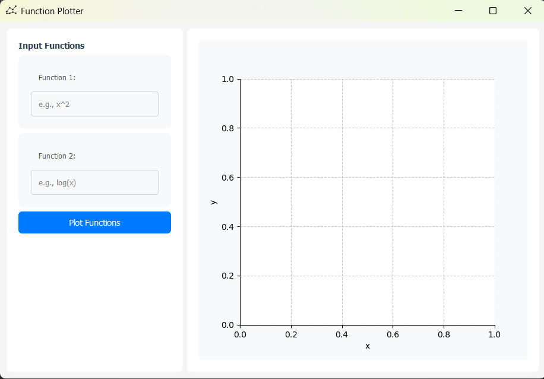

# Plotting Functions
Example 1: Plotting two functions, f(x) = x^2 + 1 and g(x) = -x^2 + 2
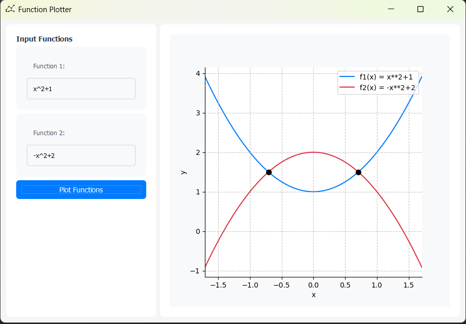
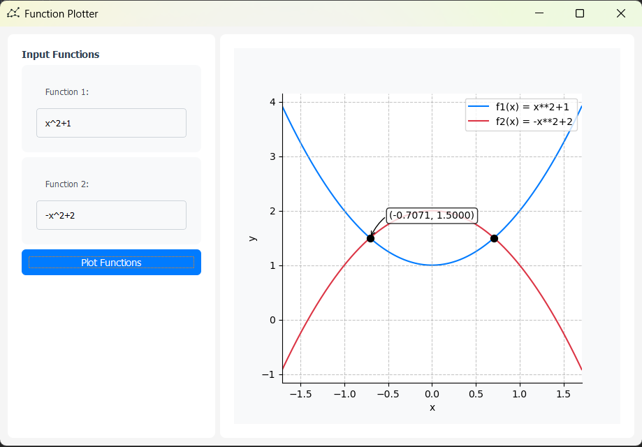
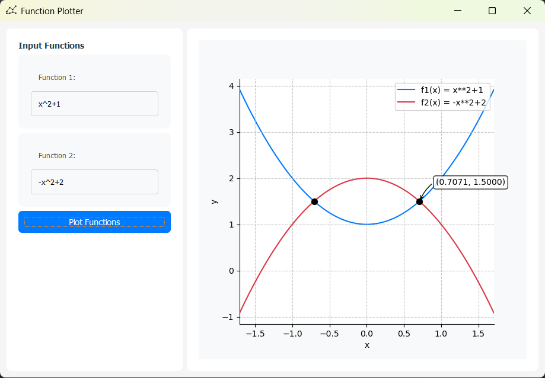
Example 2: Plotting two functions, f(x) = log(x) and g(x) = -x^2 + 2
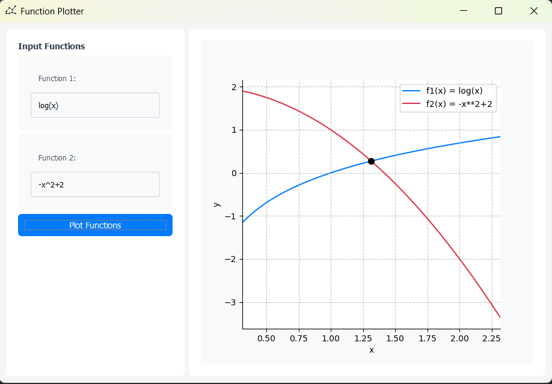
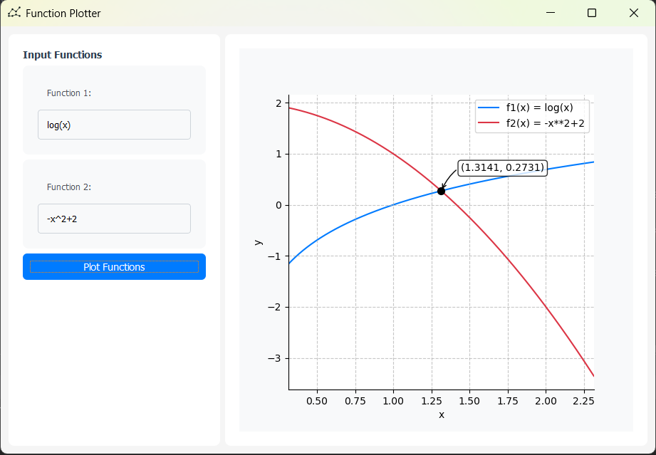
Example 3: Plotting two functions, f(x) = log(x^2+2) and g(x) = -x^2+2
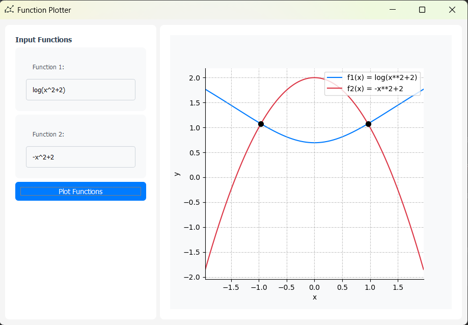
# Invalid Input
Both input fields are empty
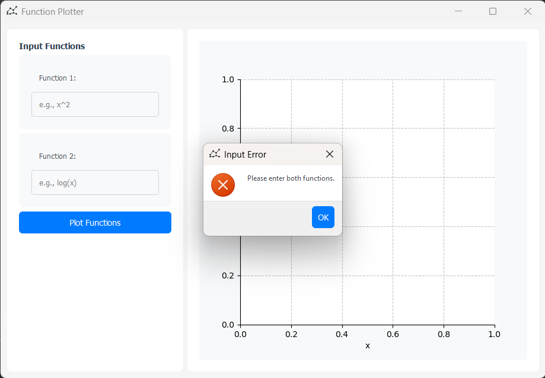
One of the input fields is empty

Invalid variable name in both input fields

Invalid variable name in one of the input fields
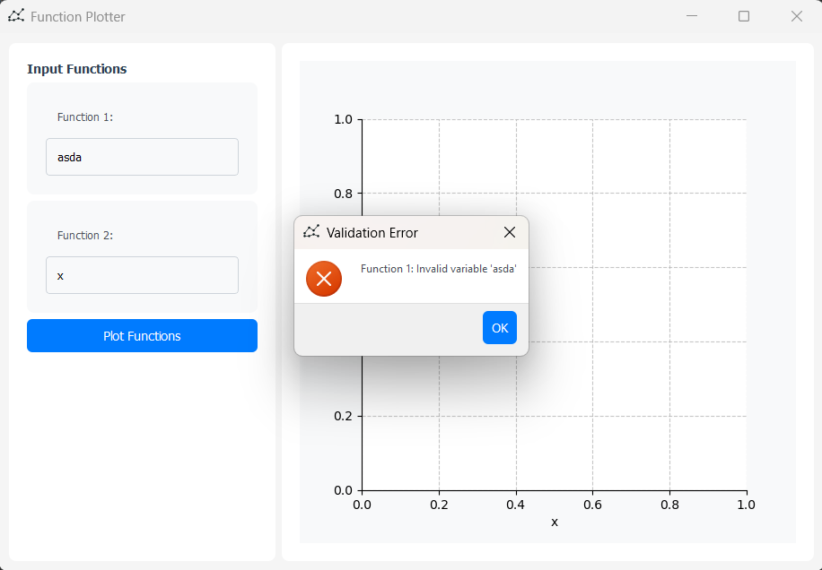
Invalid log function
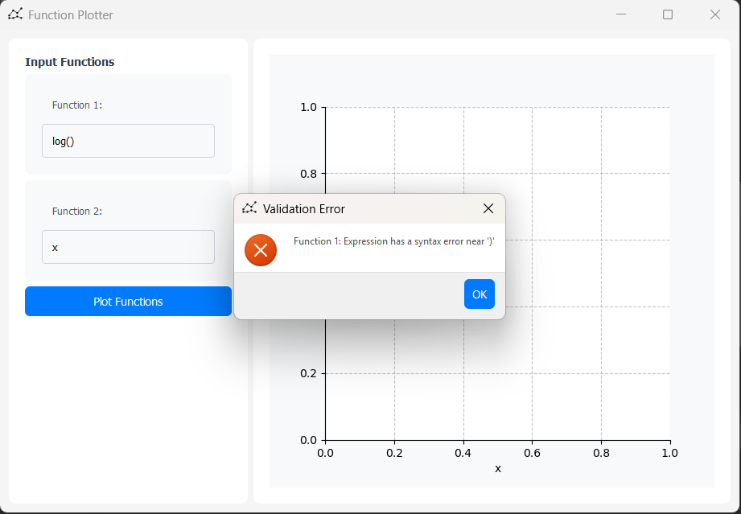
Incomplete expression
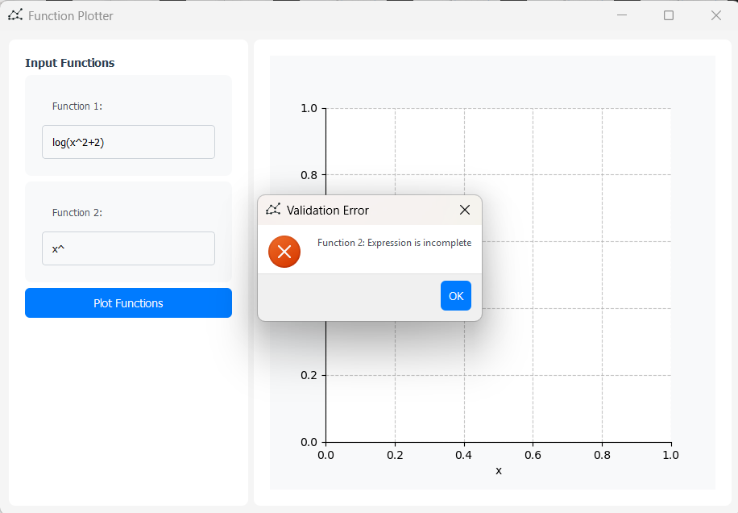

## License

MIT License - see LICENSE file for details.