# FunctionSolver

A desktop app for plotting and comparing two mathematical functions, built around a hand-written lexer and parser (using PLY — Python's Lex/Yacc) that validates expressions before they're ever evaluated.

Originally built for Master Micro's 2025 Winter SW internship.

## What it does

- **Scans and parses mathematical expressions from scratch.** Input isn't just passed to `eval` — it goes through a proper tokenizer (`ExpressionLexer`) and a grammar-based parser (`ExpressionParser`) built with PLY, enforcing operator precedence (`+`, `-`, `*`, `/`, `^`, unary minus) and validating supported functions (`log`, `sqrt`) and variable names before anything is plotted.
- **Catches invalid input with specific, readable errors** — invalid characters, unsupported variable names, incomplete expressions, and syntax errors are all detected at the lexer/parser stage and surfaced to the user with a clear message rather than a stack trace.
- **Plots two functions simultaneously** and finds their intersection points (via SymPy) once both expressions pass validation.
- **Interactive plot** with hover information for exploring function values.

## Architecture

```
src/function_solver/
├── core/
│   ├── expression_lexer.py    # Tokenizer (PLY lex) — numbers, operators, log/sqrt, variables
│   ├── expression_parser.py   # Grammar + precedence rules (PLY yacc)
│   └── solver.py              # SymPy-based equation solving and evaluation
├── gui/
│   ├── app.py                 # Main window
│   └── components/            # Input widget (validation + error display), plotter widget
└── main.py                    # Entry point
```

The GUI only calls into `Solver` once both input expressions pass `ExpressionParser.validate()`, keeping expression validation fully decoupled from the UI and testable on its own (see `tests/core/`).

## Installation

```bash
# Clone the repository
git clone https://github.com/Zaituny/FunctionSolver.git
cd FunctionSolver

# Install dependencies
python -m pip install -r requirements.txt
```

## Running

```bash
python -m src.function_solver.main
```

## Running tests

```bash
pytest
```

Covers the lexer, parser, solver, and GUI (`tests/core/`, `tests/gui/`).

## Screenshots

**Main window**

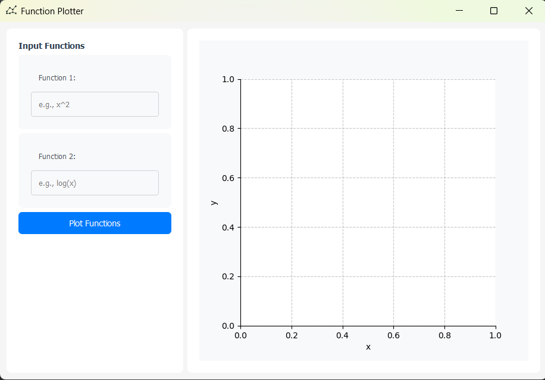

**Plotting functions**

Example 1: f(x) = x^2 + 1 and g(x) = -x^2 + 2
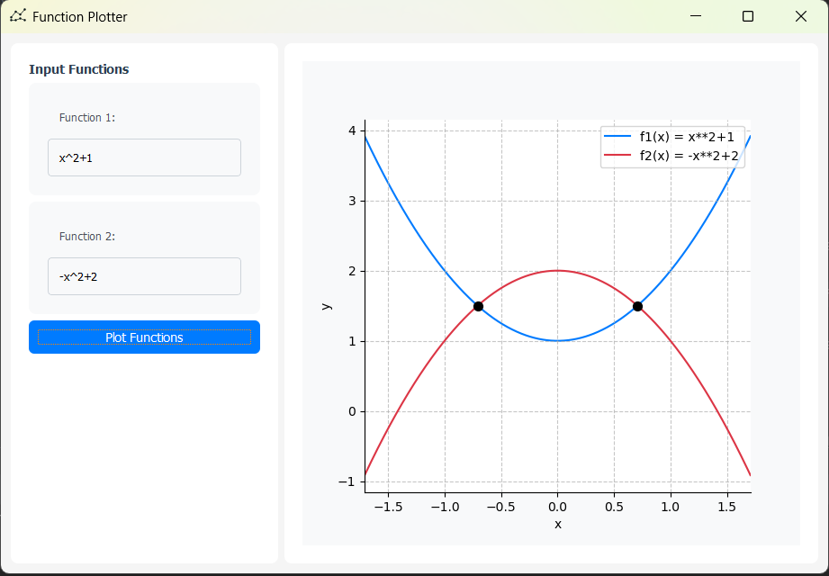
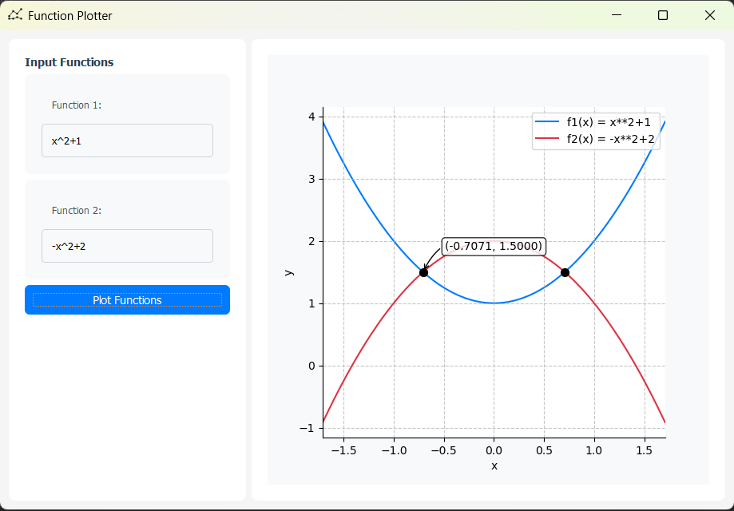
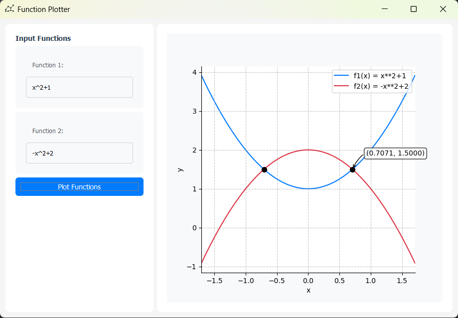

Example 2: f(x) = log(x) and g(x) = -x^2 + 2
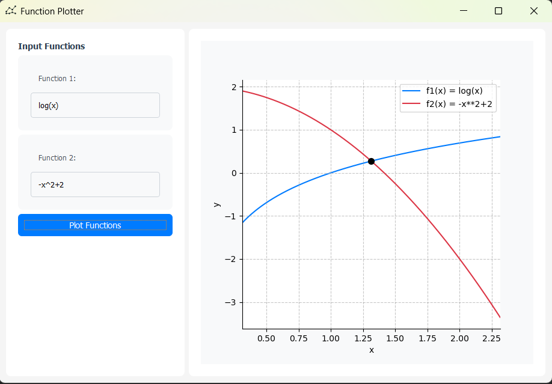
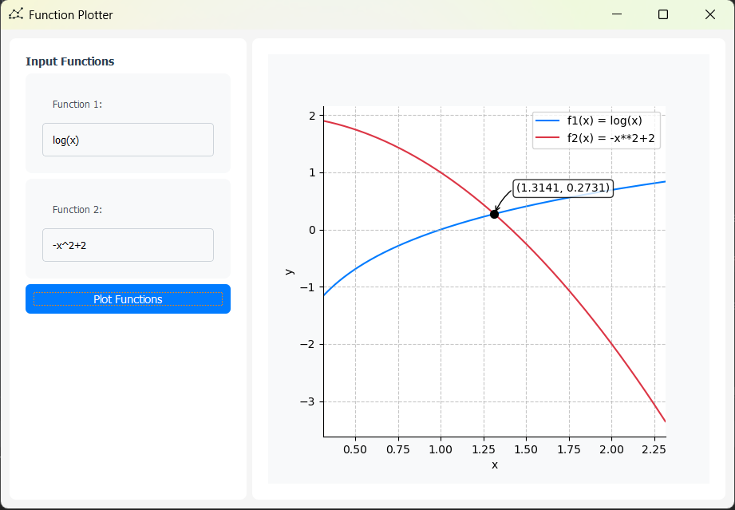

Example 3: f(x) = log(x^2+2) and g(x) = -x^2+2
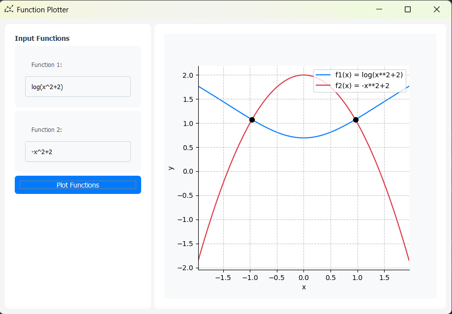

**Validation errors**

Both input fields empty
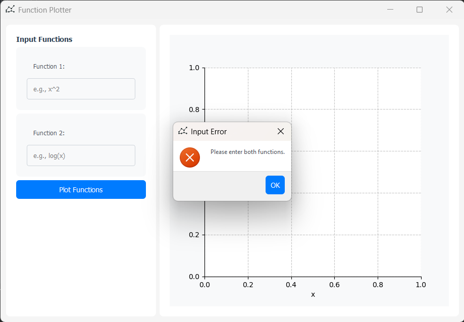

One input field empty


Invalid variable name in both fields


Invalid variable name in one field
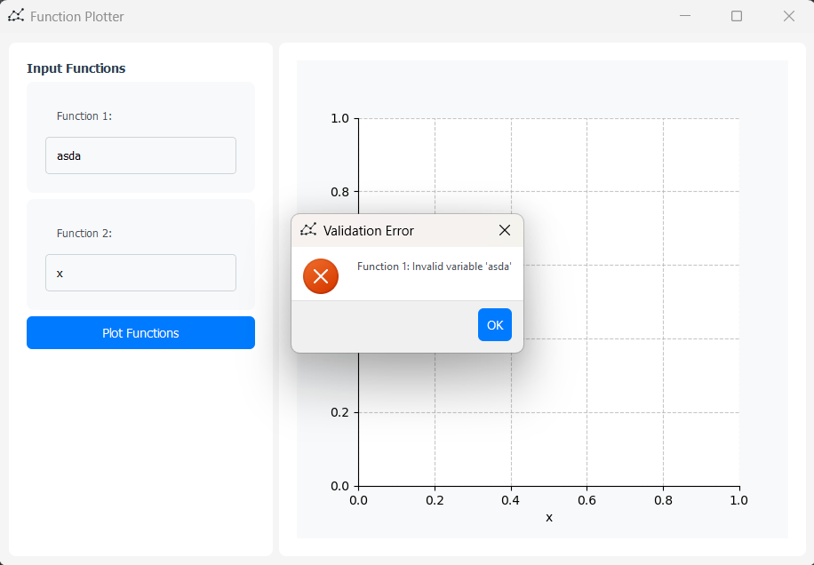

Invalid log expression
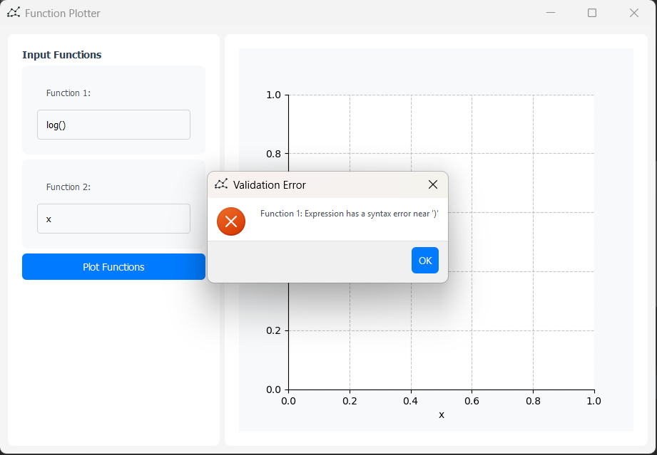

Incomplete expression
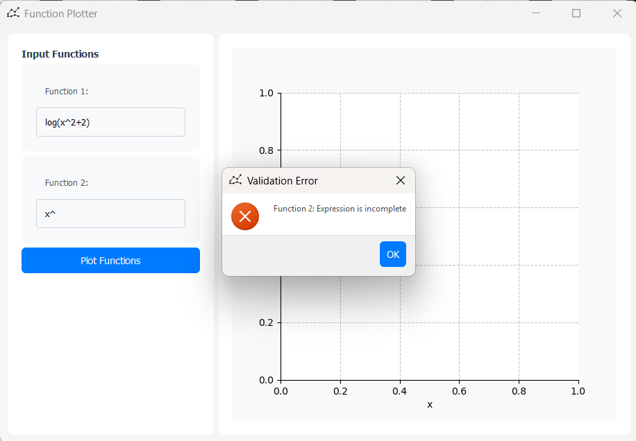

## Tech stack

Python, PLY (Lex/Yacc), SymPy, PySide2 (Qt for Python), Matplotlib, pytest / pytest-qt

## License

MIT License — see LICENSE file for details.
